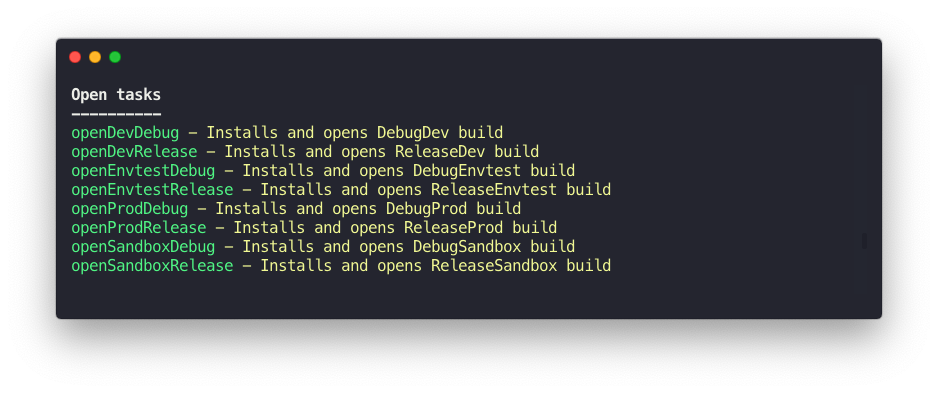

<h1 align="center">Android Rocket Launcher</h1>
<p align="center">Gradle plugin that adds tasks to your android modules for <strong>installing</strong> and <strong>launching</strong> all variants</p>
<p align="center">
  <a href="https://bintray.com/cesarferreira/maven/android-rocket-launcher/_latestVersion"></a>
  <a href="https://github.com/cesarferreira/android-rocket-launcher/blob/master/LICENSE"></a>
    <a href="https://github.com/cesarferreira/android-rocket-launcher/issues?q=is%3Aissue+is%3Aclosed"></a>

</p>

<p align="center">

</p>

## How to use
Paste this code into your main `build.gradle`

```groovy
dependencies {
    // ...
    classpath 'com.cesarferreira:android-rocket-launcher:1.0.0'
}
```

Paste this code into your app module `build.gradle`
```groovy
apply plugin: 'android-rocket-launcher'
```

Now, when you run `./gradlew tasks`, you'll see something like this:

```
openDevDebug - Installs and opens DevDebug build
openDevRelease - Installs and opens DevRelease build
openEnvtestDebug - Installs and opens EnvtestDebug build
openEnvtestRelease - Installs and opens EnvtestRelease build
openProdDebug - Installs and opens ProdDebug build
openProdRelease - Installs and opens ProdRelease build
openSandboxDebug - Installs and opens SandboxDebug build
openSandboxRelease - Installs and opens SandboxRelease build
```

### Alternative
Copy-pasting this gradle task on every project

```groovy
// Running the APK on your Android Device
android.applicationVariants.all { variant ->
    if (variant.install) {
        tasks.create(name: "run${variant.name.capitalize()}", type: Exec,
                dependsOn: variant.install) {
            group = 'Run'
            description "Installs and Runs the APK for ${variant.description}."
            def getMainActivity = { file ->
                new XmlSlurper().parse(file).application.activity.find {
                    it.'intent-filter'.find { filter ->
                        return filter.action.find {
                            it.'@android:name'.text() == 'android.intent.action.MAIN'
                        } \
                                 && filter.category.find {
                            it.'@android:name'.text() == 'android.intent.category.LAUNCHER'
                        }
                    }
                }.'@android:name'
            }
            doFirst {
                def activityClass =
                        getMainActivity(variant.outputs.processManifest.manifestOutputFile)
                commandLine android.adbExe, 'shell', 'am', 'start', '-n',
                        "${variant.applicationId}/${activityClass}"
            }
        }
    }
}
```

It's a no brainer :smile:

## Maintainers

- [Cesar Ferreira](http://cesarferreira.com)

## License

MIT
